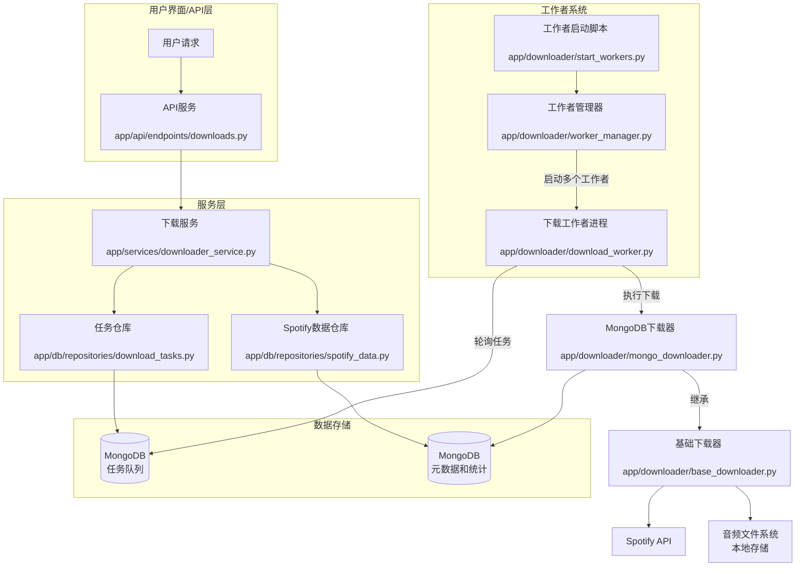

## 音乐下载任务系统架构图

## 进程流程说明

1. **API服务进程**
   - 接收来自用户的下载请求
   - 通过`DownloaderService`创建下载任务
   - 代码路径：`app/api/endpoints/downloads.py`

2. **工作者管理器进程**
   - 由`start_workers.py`脚本启动
   - 管理和监控多个下载工作者进程
   - 负责工作者进程的生命周期管理
   - 代码路径：`app/downloader/worker_manager.py`

3. **下载工作者进程**
   - 由工作者管理器启动并管理
   - 轮询MongoDB中的任务队列
   - 使用MongoDB下载器执行实际下载
   - 更新任务状态和统计信息
   - 代码路径：`app/downloader/download_worker.py`

## 数据流

1. **任务创建流程**
   - 用户请求 → API服务 → DownloaderService → DownloadTaskRepository → MongoDB(任务队列)

2. **任务执行流程**
   - 下载工作者 → 轮询MongoDB(任务队列) → 获取任务 → MongoDB下载器 → 基础下载器 → Spotify API → 音频文件系统

3. **状态更新流程**
   - 下载工作者 → 更新任务状态 → MongoDB(任务队列)
   - 下载工作者 → 保存元数据和统计 → MongoDB(元数据和统计)

## 关键组件职责

1. **DownloaderService**
   - 创建下载任务
   - 获取和保存Spotify元数据
   - 执行下载任务

2. **DownloadTaskRepository**
   - 管理任务队列
   - 提供任务CRUD操作
   - 任务状态管理和查询

3. **WorkerManager**
   - 启动和管理多个工作者进程
   - 监控工作者健康状态
   - 处理工作者异常情况

4. **DownloadWorker**
   - 轮询和获取待处理任务
   - 执行下载任务
   - 更新任务状态和进度
   - 清理卡住的任务

5. **AsyncMongoDBSpotifyDownloader**
   - 连接MongoDB存储
   - 保存和加载元数据和统计信息
   - 执行实际的下载操作

6. **BaseSpotifyDownloader**
   - 实现Spotify API访问
   - 处理音频下载逻辑
   - 提供错误处理和重试机制